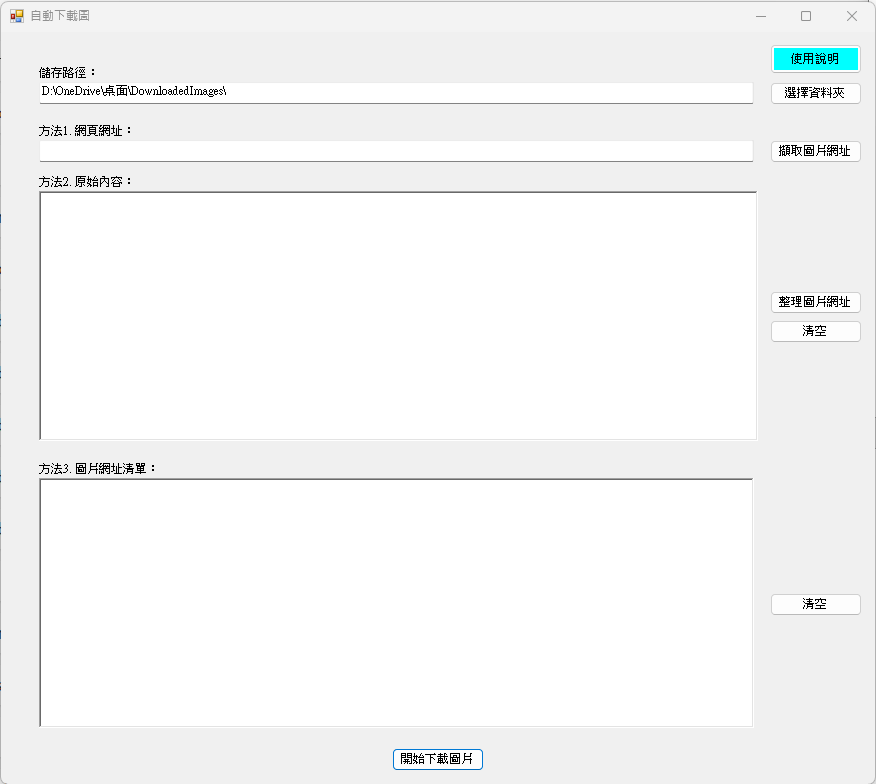

# Auto Image Downloader（自動下載圖片工具）

Auto Image Downloader 是一款以 **C# Windows Forms** 開發的、  
能從多種來源自動擷取圖片網址並批次下載的工具。

本工具提供三種方式取得圖片來源網址：

**方法 1：輸入網頁網址 → 自動擷取 HTML 中的所有圖片**  
**方法 2：貼入原始內容（HTML/文字）→ 自動整理並擷取圖片網址**  
**方法 3：直接使用圖片網址清單（一行一個）→ 批次下載**  

適合用來收集圖片、資料備份、建立資料集、批次下載圖庫等用途。

---

## 使用者介面
 
---

## 系統功能

### ✔ 方法 1：輸入網頁網址擷取圖片
- 支援 `` 自動解析  
- 會自動將相對路徑轉為完整 URL  
- 過濾非圖片的連結  
- 每行一個網址輸出，可再人工調整  

---

### ✔ 方法 2：貼入原始內容擷取圖片
- 可貼 HTML、JavaScript 片段、爬蟲結果、整段文字  
- 自動萃取所有 `.jpg`, `.jpeg`, `.png`, `.gif`, `.webp`  
- 自動移除重複連結  
- 適合無法直接解析的動態網站（手動貼原始碼後整理）

---

### ✔ 方法 3：手動輸入圖片網址清單
- 允許使用者提供每行一個圖片網址  
- 可直接下載整份圖片清單  
- 適合 AI 資料集、研究用途、批次圖片備份  

---

### ✔ 圖片下載功能
- 下載前會自動建立儲存資料夾  
- 若檔案重複，會自動命名為 `filename(1).jpg`, `filename(2).jpg`…  
- 支援 HTTP / HTTPS  
- 支援 UTF-8 網址  

---

## 使用方式

### 1. 設定儲存資料夾  
點「選擇資料夾」，或編輯輸入欄位。  
若資料夾不存在，程式會自動建立。

---

### 2. 選擇一種方法取得圖片網址  

#### 方法 1：輸入網頁網址  
輸入網址 → 按「擷取圖片網址」

#### 方法 2：貼原始內容  
貼入 HTML/文字 → 按「整理圖片網址」

#### 方法 3：直接輸入網址  
於圖片網址清單輸入每行一個網址

---

### 3. 按「開始下載圖片」  
程式會依序下載所有圖片。

---

## 注意事項

- 不支援需要登入才能查看內容的網站（例如 Facebook / Instagram / 蝦皮）  
- 部分網站使用動態載入（JavaScript），方法 1 可能抓不到圖片  
  → 建議使用方法 2（貼原始碼）  
- 若伺服器禁止存取、圖片網址失效，該圖片將無法下載  
- 本工具僅供學習與個人用途，請遵守目標網站的使用規範  

---

## 技術細節

- 語言：C#  
- 框架：.NET Framework / Windows Forms  
- HTML 解析：正規表達式（Regex）  
- 圖片下載：`WebClient.DownloadFile()`  
- 自動命名：避免覆蓋  
- 支援副檔名：`.jpg .jpeg .png .gif .webp`  

